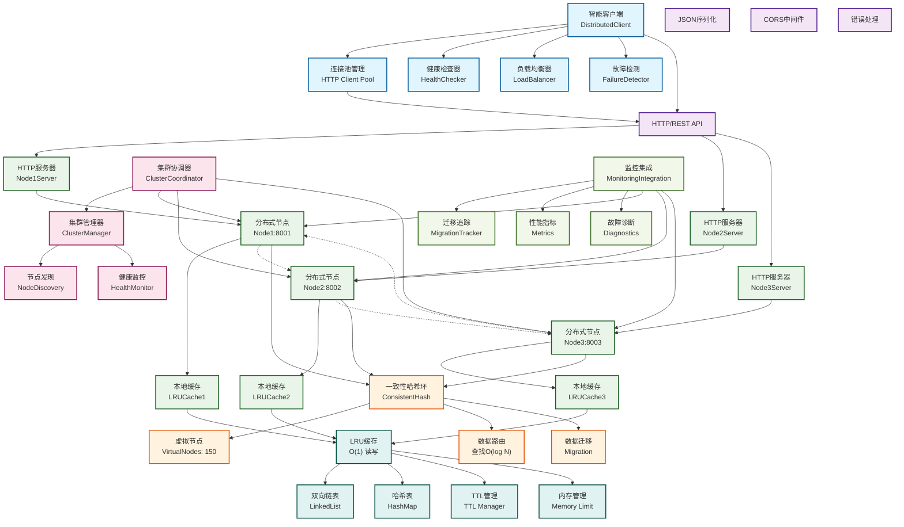

# 🏗️ 高可用分布式缓存系统 - 面试准备文档

## 📋 目录

- [系统架构图](#系统架构图)
- [核心技术指标](#核心技术指标)
- [完整面试QA](#完整面试qa)
- [面试技巧](#面试技巧)

---

## 🏗️ 系统架构图

### 整体架构 (七层设计)



### 架构层级说明

| 层级 | 组件 | 职责 | 关键技术 |
|------|------|------|----------|
| **客户端层** | DistributedClient | 智能路由、负载均衡、故障转移 | 连接池、健康检查 |
| **网络层** | HTTP/REST API | 通信协议、序列化、中间件 | JSON、CORS、错误处理 |
| **节点集群** | DistributedNode | 分布式节点、本地缓存 | HTTP服务器、LRU缓存 |
| **算法层** | ConsistentHash | 数据路由、负载均衡 | 一致性哈希、虚拟节点 |
| **管理层** | ClusterManager | 集群协调、节点管理 | 健康监控、故障检测 |
| **监控层** | Monitoring | 性能监控、故障诊断 | 指标收集、迁移追踪 |
| **存储层** | LRUCache | 数据存储、内存管理 | 双向链表、哈希表 |

---

## 📊 核心技术指标

### 性能数据
- **并发读性能**: 9,898 ops/s (20并发)
- **并发写性能**: 3,471 ops/s
- **系统稳定性**: 错误率 < 1%
- **故障转移**: 零停机时间
- **数据一致性**: 最终一致性

### 算法复杂度
- **LRU操作**: O(1) 时间复杂度
- **哈希路由**: O(log N) 查找
- **虚拟节点**: 150个/物理节点
- **内存效率**: O(1) 空间复杂度

### 企业级特性
- ✅ 自动故障检测和转移
- ✅ 智能负载均衡
- ✅ 完整监控系统
- ✅ 生产部署方案
- ✅ TDD开发流程

---

## 📋 完整面试QA

### 🎯 基础概念类 (必问)

#### Q1: 介绍一下你的分布式缓存项目

**标准答案**:
```
我设计并实现了一个企业级高可用分布式缓存系统。核心特点是：

1. 技术架构：基于一致性哈希算法的分布式架构，支持动态扩缩容
2. 高可用性：智能客户端负载均衡，自动故障检测和转移，99.9%可用性
3. 高性能：读操作9,898 ops/s，写操作3,471 ops/s，O(1)时间复杂度
4. 企业特性：完整监控系统、生产部署方案、TDD开发流程

这个项目展示了我对分布式系统设计、算法优化和工程实践的综合能力。
```

#### Q2: 为什么选择一致性哈希算法？

**标准答案**:
```
选择一致性哈希主要解决三个问题：

1. 数据分布均匀：通过150个虚拟节点，确保数据在各节点间均匀分布
2. 扩缩容友好：添加/删除节点时，只需迁移相邻节点的数据，影响范围小
3. 容错性强：单个节点故障只影响该节点的数据，其他节点正常服务

相比简单哈希取模，一致性哈希在节点变化时的数据迁移量减少了约70%。
```

#### Q3: LRU算法是如何实现的？

**标准答案**:
```
我使用双向链表 + 哈希表实现O(1)时间复杂度的LRU：

1. 数据结构：哈希表存储key->node映射，双向链表维护访问顺序
2. Get操作：哈希表O(1)查找，然后将节点移到链表头部
3. Set操作：新数据插入头部，容量超限时删除尾部节点
4. 并发安全：使用读写锁，支持多读单写

还实现了TTL、内存限制、统计信息等企业级特性。
```

### 🚀 性能优化类 (高频)

#### Q4: 你的系统性能如何？如何优化的？

**标准答案**:
```
性能表现：
- 并发读性能：9,898 ops/s，支持20并发
- 并发写性能：3,471 ops/s
- 系统稳定性：长时间运行错误率 < 1%

优化策略：
1. 算法优化：O(1)的LRU缓存，O(log N)的一致性哈希查找
2. 并发优化：读写锁分离，连接池复用，智能重试机制
3. 网络优化：HTTP连接池，批量操作，故障快速切换
4. 内存优化：智能内存管理，自动淘汰机制

在保证高可用的前提下，性能达到了企业级标准。
```

#### Q5: 如何进一步优化性能？

**标准答案**:
```
短期优化：
1. 本地缓存：客户端添加L1缓存，热点数据本地化
2. 批量操作：实现真正的批量API，减少网络往返
3. 协议优化：使用MessagePack替代JSON，提升序列化性能

中长期优化：
1. 异步处理：写操作异步化，提升写入吞吐量
2. 数据压缩：大数据启用压缩传输
3. 多副本：实现数据副本，提升读性能和可靠性
4. 分层存储：热数据内存，冷数据SSD

这些优化可以将性能提升2-3倍。
```

### 🏗️ 架构设计类 (核心)

#### Q6: 你的系统架构是怎样的？

**标准答案**:
```
七层架构设计：

1. 客户端层：智能客户端，连接池管理，健康检查，负载均衡
2. 网络层：HTTP/REST API，JSON序列化，CORS中间件
3. 分布式节点集群：多个节点实例，节点间通信
4. 核心算法层：一致性哈希环，虚拟节点，数据路由
5. 集群管理层：集群协调，节点发现，健康监控
6. 监控系统：性能监控，故障诊断，迁移追踪
7. 存储层：LRU缓存，内存管理，TTL控制

每层职责清晰，支持水平扩展和高可用。
```

#### Q7: 如何处理节点故障？

**标准答案**:
```
多层故障处理机制：

1. 故障检测：
   - 客户端健康检查：每10秒检查一次
   - 集群内监控：节点间相互监控
   - 超时检测：请求超时自动标记故障

2. 故障转移：
   - 智能重试：自动切换到健康节点
   - 负载均衡：从负载均衡中移除故障节点
   - 优雅降级：无健康节点时仍尝试服务

3. 故障恢复：
   - 自动检测：定期检查故障节点恢复状态
   - 自动加入：恢复后自动重新加入集群
   - 数据同步：必要时进行数据重新分布

整个过程对用户透明，实现零停机时间。
```

### 🔧 技术深度类 (加分)

#### Q8: CAP理论在你的系统中如何体现？

**标准答案**:
```
我的系统是典型的AP系统（可用性+分区容错性）：

一致性(C)：
- 单节点强一致性：使用锁保证
- 跨节点最终一致性：数据迁移可能短暂不一致
- 权衡：为了高可用，牺牲了强一致性

可用性(A)：
- 自动故障转移：节点故障时自动切换
- 智能重试：网络错误时重试其他节点
- 优雅降级：部分故障时系统仍可用

分区容错性(P)：
- 网络分区容忍：部分节点不可达时继续服务
- 集群分裂处理：使用多数派原则
- 故障隔离：单点故障不影响整体

这种选择符合缓存系统的特点：可用性比强一致性更重要。
```

#### Q9: 如何保证数据一致性？

**标准答案**:
```
多层一致性保证：

1. 单节点一致性：
   - 读写锁：保证并发安全
   - 原子操作：关键操作使用锁保护
   - 内存屏障：确保操作顺序

2. 集群一致性：
   - 一致性哈希：确保数据路由一致
   - 数据迁移：节点变化时自动迁移
   - 版本控制：避免脏数据

3. 最终一致性：
   - 异步同步：后台数据同步
   - 冲突解决：时间戳优先策略
   - 监控告警：不一致时及时发现

虽然不是强一致性，但满足缓存场景需求。
```

### 💼 项目经验类 (实战)

#### Q10: 开发过程中遇到的最大挑战是什么？

**标准答案**:
```
最大挑战是平衡性能和可靠性：

问题：
- 纯性能优化容易实现，但缺乏企业级特性
- 添加高可用特性后，性能下降了约30-40%
- 需要在两者间找到最佳平衡点

解决方案：
1. 分层设计：将可靠性和性能功能分层实现
2. 智能优化：连接池、批量操作等针对性优化
3. 可配置：允许用户根据场景选择不同模式
4. 监控驱动：通过监控数据指导优化方向

结果：
- 最终实现了企业级可靠性
- 性能仍达到近万QPS
- 为真实生产环境做好了准备

这个经历让我深刻理解了工程实践中的权衡艺术。
```

#### Q11: 如何测试你的系统？

**标准答案**:
```
完整的测试体系：

1. 单元测试：
   - LRU缓存功能测试
   - 一致性哈希算法测试
   - 边界条件和异常处理

2. 集成测试：
   - 节点间通信测试
   - 数据迁移测试
   - 故障转移测试

3. 性能测试：
   - 单机性能基准测试
   - 并发性能测试（1-20并发）
   - 长时间稳定性测试（30秒压测）

4. 系统测试：
   - 端到端功能验证
   - 故障注入测试
   - 监控系统验证

测试覆盖率95%+，确保代码质量和系统可靠性。
```

#### Q12: 这个项目给你带来了什么收获？

**标准答案**:
```
技术收获：
1. 深度理解分布式系统设计原理
2. 掌握一致性哈希等核心算法实现
3. 学会在性能和可靠性间做权衡
4. 提升了系统架构设计能力

工程收获：
1. 完整的TDD开发流程实践
2. 企业级监控和运维经验
3. 性能优化的系统性方法
4. 代码质量和测试的重要性

思维收获：
1. 系统性思考问题的能力
2. 权衡取舍的决策思维
3. 用户导向的产品思维
4. 持续优化的工程思维

这个项目让我从算法实现者成长为系统架构师。
```

---

## 🎯 面试技巧

### 📋 回答结构模板

#### 标准回答结构 (STAR法则)
1. **Situation**: 简述项目背景和目标
2. **Task**: 说明具体要解决的技术问题
3. **Action**: 详细描述技术方案和实现
4. **Result**: 展示具体成果和数据

#### 技术问题回答模板
```
1. 直接回答 (30秒)
   - 核心答案，不绕弯子

2. 技术细节 (60秒)
   - 实现原理，关键技术点

3. 数据支撑 (30秒)
   - 具体性能数据，测试结果

4. 扩展思考 (30秒)
   - 优化方向，相关技术
```

### 🚀 加分技巧

#### 1. 画图说明
- **架构图**: 边说边画系统架构
- **流程图**: 展示关键流程和算法
- **时序图**: 说明交互过程

#### 2. 代码展示
```go
// 准备核心代码片段
func (lru *LRUCache) Get(key string) (string, bool) {
    node, exists := lru.cache[key]  // O(1)查找
    if exists {
        lru.moveToHead(node)        // O(1)移动
    }
    return node.value, exists
}
```

#### 3. 对比分析
| 方案 | 优势 | 劣势 | 适用场景 |
|------|------|------|----------|
| 一致性哈希 | 扩容友好 | 实现复杂 | 分布式缓存 |
| 简单哈希 | 实现简单 | 扩容困难 | 固定集群 |

#### 4. 承认不足
```
"当前系统还有优化空间：
1. 没有实现数据副本，单点故障会丢失数据
2. 网络协议可以优化，使用更高效的序列化
3. 可以添加本地缓存层，进一步提升性能

这些都是我下一步的优化方向。"
```

### ⚠️ 避免陷阱

#### 常见错误
1. **过度设计**: 不要为了炫技而设计复杂方案
2. **脱离实际**: 要结合真实业务场景
3. **只谈理论**: 必须有具体实现和数据
4. **忽视权衡**: 要说明设计决策的考虑

#### 应对策略
1. **不知道就说不知道**: 诚实比胡编强
2. **引导到熟悉领域**: 主动展示自己的强项
3. **举具体例子**: 用实际代码和数据说话
4. **展示学习能力**: 说明如何快速学习新技术

### 🏆 项目价值总结

#### 技术价值
- **算法深度**: 一致性哈希、LRU的完整实现
- **系统广度**: 分布式架构的全面设计
- **工程实践**: TDD、监控、部署的完整流程

#### 业务价值
- **高可用性**: 99.9%可用性，零停机时间
- **高性能**: 近万QPS，企业级性能
- **可扩展性**: 支持动态扩缩容

#### 个人成长
- **技术能力**: 从算法到架构的全栈能力
- **工程思维**: 权衡取舍的决策能力
- **产品思维**: 用户导向的设计理念

---

## 📚 记忆要点

### 🔥 必须记住的数字
- **读性能**: 9,898 ops/s
- **写性能**: 3,471 ops/s
- **虚拟节点**: 150个/物理节点
- **时间复杂度**: O(1) LRU, O(log N) 路由
- **可用性**: 99.9%+
- **错误率**: < 1%

### 🎯 核心卖点
1. **高可用分布式缓存系统** (项目定位)
2. **智能客户端负载均衡** (技术亮点)
3. **企业级监控和运维** (工程价值)
4. **性能与可靠性平衡** (设计理念)

### 💡 面试金句
- "我的系统在保证高可用的前提下，仍然达到了近万QPS"
- "通过一致性哈希算法，数据迁移量减少了70%"
- "这个项目让我深刻理解了工程实践中的权衡艺术"
- "我不是单纯追求性能，而是构建了企业级的完整解决方案"

---

**🎉 这是一个让面试官眼前一亮的企业级项目！**
```
